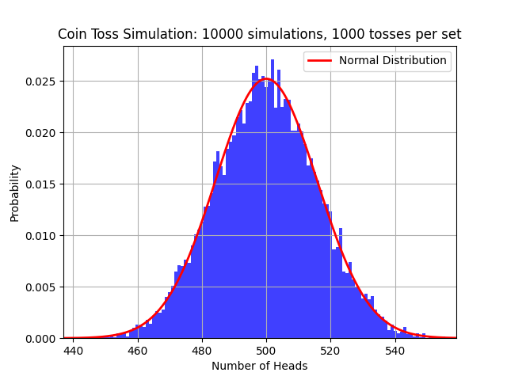
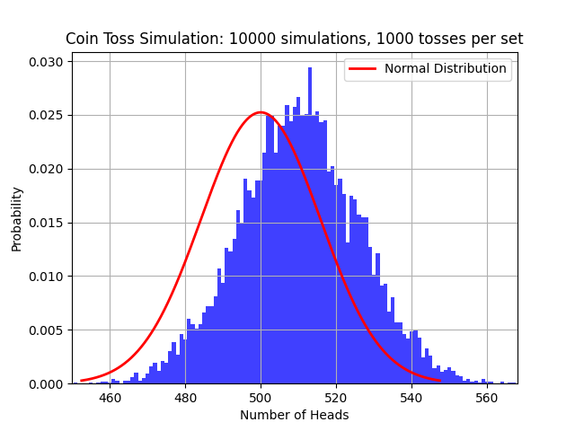

# Cointos_Simulator

This project simulates tossing a fair coin multiple times to analyze the distribution of the number of heads obtained. It demonstrates the convergence of the binomial distribution to the normal distribution as the number of tosses increases. The simulation results are saved and plotted, optionally compared with the theoretical normal distribution.



## Table of Contents

- [Installation](#installation)
- [Usage](#usage)
- [Configuration](#configuration)
- [Output](#output)
- [Project Structure](#project-structure)
- [Extending the Project](#extending-the-project)
- [License](#license)
- [Acknowledgements](#acknowledgements)

## Installation

### Requirements

- Python 3.6 or higher
- The following Python packages:
  - `pandas`
  - `matplotlib`
  - `pyyaml`

### Install Dependencies

All required packages are listed in the `requirements.txt` file. To install them, run:

```bash
pip install -r requirements.txt
```

Alternatively, you can install the required packages individually:

```bash
pip install pandas matplotlib pyyaml
```

*Note: It’s recommended to use a virtual environment to avoid conflicts with other projects.*

## Usage

### 1. Clone the Repository

```bash
git clone https://github.com/yokyomitsu/Cointos_Simulator.git
cd Cointos_Simulator
```

### 2. Configure Simulation Parameters

Edit the `config.yaml` file to set the number of tosses per simulation and the number of simulations to run.

Example `config.yaml`:

```yaml
n_tosses: 100
n_simulations: 1000
probability_head : 0.5
```


If the probability of a coin landing on heads is biased at 0.51, then the expected ratio of heads to tails would be 0.51:0.49.  
You can see the result as this attached image.

```yaml
n_tosses: 100
n_simulations: 1000
probability_head : 0.5
```



### 3. Run the Simulation

Execute the main script:

```bash
python main.py
```

### 4. View Results

After the simulation completes, results are saved in a timestamped directory (e.g., `results_20231005_123456`). This directory contains:

- `config.yaml`: A copy of the configuration used.
- `results.csv`: The simulation results.
- `plot.png`: Histogram of the simulation results, optionally overlaid with the theoretical normal distribution curve.

## Configuration

Simulation parameters are set in the `config.yaml` file located at the root of the project.

- `n_tosses` (integer): Number of coin tosses per simulation.
- `n_simulations` (integer): Total number of simulations to run.

Example:

```yaml
n_tosses: 100
n_simulations: 1000
```

*Note: Ensure the `config.yaml` file is properly formatted in YAML syntax.*

## Output

### Results Directory

A new directory named `results_<timestamp>` (e.g., `results_20231005_123456`) is created for each simulation run. It contains:

- **`config.yaml`**: The configuration file used for the simulation.
- **`results.csv`**: A CSV file with the number of heads obtained in each simulation.
- **`plot.png`**: A histogram of the simulation results, optionally overlaid with the theoretical normal distribution.

### Viewing the Plot

To display the plot during execution, uncomment the `plt.show()` line in `main.py`:

```python
# Turn on if you want to see the result
plt.show()
```

## Project Structure

```
├── main.py
├── config.yaml
├── requirements.txt
├── src
│   ├── __init__.py
│   ├── configLoader.py
│   ├── coinTossSimulator.py
│   └── resultPlotter.py
└── README.md
```

- **`main.py`**: The main script that orchestrates the simulation.
- **`config.yaml`**: Configuration file for simulation parameters.
- **`requirements.txt`**: List of Python package dependencies.
- **`src/`**: Directory containing the source code modules:
  - **`configLoader.py`**: Contains `YAMLConfigLoader` class to load configurations from a YAML file.
  - **`coinTossSimulator.py`**: Contains `CoinTossSimulator` class to perform the simulations.
  - **`resultPlotter.py`**: Contains `ResultPlotter` class to plot the simulation results.

## Extending the Project

- **Biased Coin Simulation**: Modify `coinTossSimulator.py` to simulate a biased coin by changing the probability of heads.
- **Command-Line Arguments**: Incorporate `argparse` to set simulation parameters via command-line.
- **Additional Plots**: Extend `ResultPlotter` to include other statistical plots (e.g., box plots, cumulative distributions).
- **Statistical Analysis**: Perform additional statistical analyses like calculating mean, variance, and confidence intervals.

## License

This project is licensed under the MIT License. See the [LICENSE](LICENSE) file for details.

## Acknowledgements

- Inspired by statistical simulations in probability theory.
- Uses standard Python libraries and follows best coding practices.
